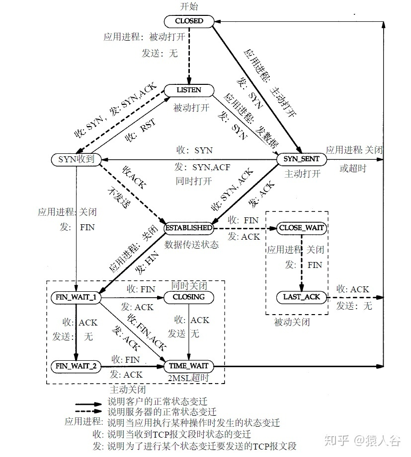

### gossip协议

最终C。周期性向外传播，有目标筛选规则。两种，固定传播所有内容，仅传播新信息

### http
cs 请求应答 无状态

#### 基本

键：host contenttype accept length encoding language user-agent cachectl

状态码：1收到，需要继续 2成功 3重定向 4c错误 5s错误

post提交c，put更新update

get用来幂等获取资源，post不幂等改变。get参数放在url，post在内容中

#### get和post区别
post header和data分开发送。get参数在地址里，post在内容里

#### http2
二进制。多个请求分块传输，实现单tcp并行，高效拥控，高效握手。

http1中请求需要排队

#### websockets
改进ajax。订阅制。

### tcpip

socket：协议、源元组、目的元组

tcp多路复用：epoll，非阻塞socket，协程

udp面向报文，有非点对点。

ttl：ip中的最长存活跳数

msl：存活最长时间

任务：寻址，连接，分段，正确送达，流控拥塞控制

内容：端口号，seq，ack，

#### 握手

为什么必须同步序列号？

三次握手为了同步起始序列号。防止连接过期请求报文延迟到达搞乱（若此则rst），或者第二次丢失，浪费服务器资源。

closed listen synsent synreceived established

syn syn/ack ack

半连接

#### 挥手

四次挥手是为了半关闭连接。半关闭，只单向发送数据

finwait1 finwait2 timewait()

fin\ack ack fin\ack ack

closewait(for app)  lastack

closing：若finwait1状态未收到返回时，先收到对方的关闭请求。

timewait优化：防止最后报文丢失，防止收到上次连接内容。timestamp迟到拒绝

rst报文关闭连接：程序遇到异常

半连接：一方崩溃另一方不知

#### 重传

seq ack字节序列号。回绕问题paws：时间戳解决。rtt：往返时间，重传，难算。rto重传时间略大于rtt。

#### 流控

MSS协商，对流控无影响。

window字段发送接收窗口。窗口合适大小：带宽*rtt。

SWS糊涂窗口：因接收方处理能力不足，产生的频繁小报文传输。解决：接收方窗口不够大就通知0，发送方：没有飞行或达到某值就发。

延迟确认减少ack报文

#### 拥控

慢启动，拥塞避免。指数增长，加法增大，乘法减小。

快速重传：失序立即报告，而不是捎带。快恢复：发现重复回执，说明未拥塞，所以从阈值开始加法增大。

#### P2P UDP TCP

基础：UDP/TCP有可靠特性

原因：1拥塞控制问题，无必要 2端口转发问题，有时候不可行

[为什么p2p模式的tunnel底层通常用udp而不是tcp？](https://mp.weixin.qq.com/s/dknMBfvdiNEc7mD_eQtqfg)

#### arp

## [Web协议详解与抓包实战](https://time.geekbang.org/course/intro/175)

#### 67 http2问题和3的意义

* tls多次往返问题
* 多路复用的对头阻塞问题
* 内核实现，更新缓慢
* quic：和udp一起，实现tcp、tls功能，提供http2api

#### 68 http3quic格式

* 更换IP地址和端口后，仍可复用原有连接
* udp先天没有队头阻塞问题
* 1rtt安全握手
* 0rtt恢复会话：缓存密钥

#### 97 减少小报文

* sws糊涂窗口：服务器能力不足，取出慢，窗口越来越小，报文越来越小
* 接收方david d clark算法：窗口小于某值时，通知为0
* 发送方nagle：没有未确认则立即发送，达到mss也发送
* 延迟确认：等延迟看有没有数据可与ack一起发送，若第二个数据段也来了要立刻发送
* nagle与延迟确认同时开启会导致延迟高
* tcp_cork与零拷贝

#### 98 拥塞控制：慢启动

* 字节流传输
* 丢包控制和带宽控制
* 慢启动：窗口扩充一倍
* 慢启动阈值和拥塞窗口共同决定发送窗口

#### 99 拥塞控制：拥塞避免

* 慢启动阈值，变线性。根据丢包调整阈值

#### 100 拥塞控制：快速重传与快速恢复

* 快速重传接受方：当收到失序段，发送缺口段ack号。收到后立即发送下一个期待段ack号。
* 快速重传发送方：不需要计时器，当连续收到三个相同的ack号，立刻发送该段。
* 快速重传不需要进入慢启动，而是快速恢复
* 快速恢复：重传中且正常ack未到达前启用。适当降低慢启动阈值和拥塞窗口。收到重复ack缓慢增加。收到新ack恢复。

#### 101 sack与选择重传

* 悲观与乐观重发
* 可选功能：支持选择确认中间报文段

#### 102 带宽控制

* 最佳拥塞控制点：路由器缓冲区为空且带宽为满

#### 103 基于带宽控制的bbr

* 取延迟多次的最小值，发送速度最大值。找到最佳控制点
* 通过定期逐渐提升带宽，看延迟测试是否有更大带宽可用

#### 104 四次握手关闭连接过程

#### 105 优化timewait

* 两倍报文最大生存时间MSL，必要性：再次使用连接可能被上一次数据包影响
* Linux tcp_tw_reuse：作为客户端可以使用处于tw的端口，根据timestamp拒绝迟到报文
* tcp_max_tw_bucket：限制最大tw状态数量，超出直接关闭

#### 106 keeplive 校验和 推数据

* 默认每闲置两小时查看连接应答
* push标记，说明数据告一段落
* urgent标记优先处理

#### 107 多路复用

* 非阻塞socket
* epoll：进程内缓冲区或连接状态变化的tcp连接

#### 108 四层负载均衡

#### 109 网络层和链路层

* 三层网络层：寻址，选路，打包，分片

#### 110 ipv4分类地址

#### 111 cidr无分类地址

* /n 网络地址范围，子网掩码

#### 112 arp与rarp

* 2.5层arp动态地址解析协议，广播请求，单播回答
* rarp反转
* arp欺骗

#### 113 nat技术和lvs负载均衡

* network address (port) translator

#### 114 选路协议

* RIP routing information protocol: 基于跳数选路，UDP传输
* OSPF open shortest path first: 所有路由都有相同信息，IP协议传输，网络到路由器没有开销

* BGP border gateway protocol：网络间的选路协议，内部ibgp和外部ebgp

#### 115 ip头部

